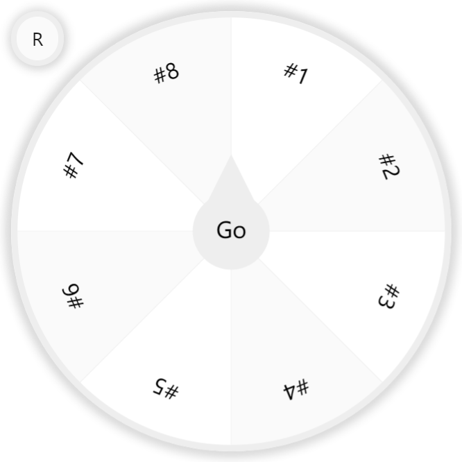

      
	  <h1>转盘</h1>

一个使用了[lucky-canvas](https://github.com/buuing/lucky-canvas)写的转盘网页

用于联赛的抽签

参考了非常多的html教程

作为纯小白我这代码可能看起来会很高血压，能跑起来就已经是我最大的能力了(;´Д`)

## 鸣谢

[Lucky-canvas 一个基于 JavaScript 的跨平台 ( 大转盘 / 九宫格 / 老虎机 ) 抽奖插件](https://github.com/buuing/lucky-canvas)

[MDN Web Docs](https://developer.mozilla.org/zh-CN/)

[菜鸟教程](https://www.runoob.com/)
